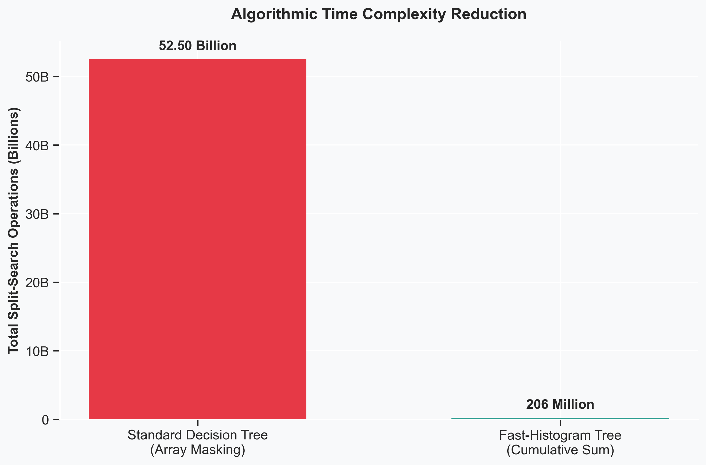
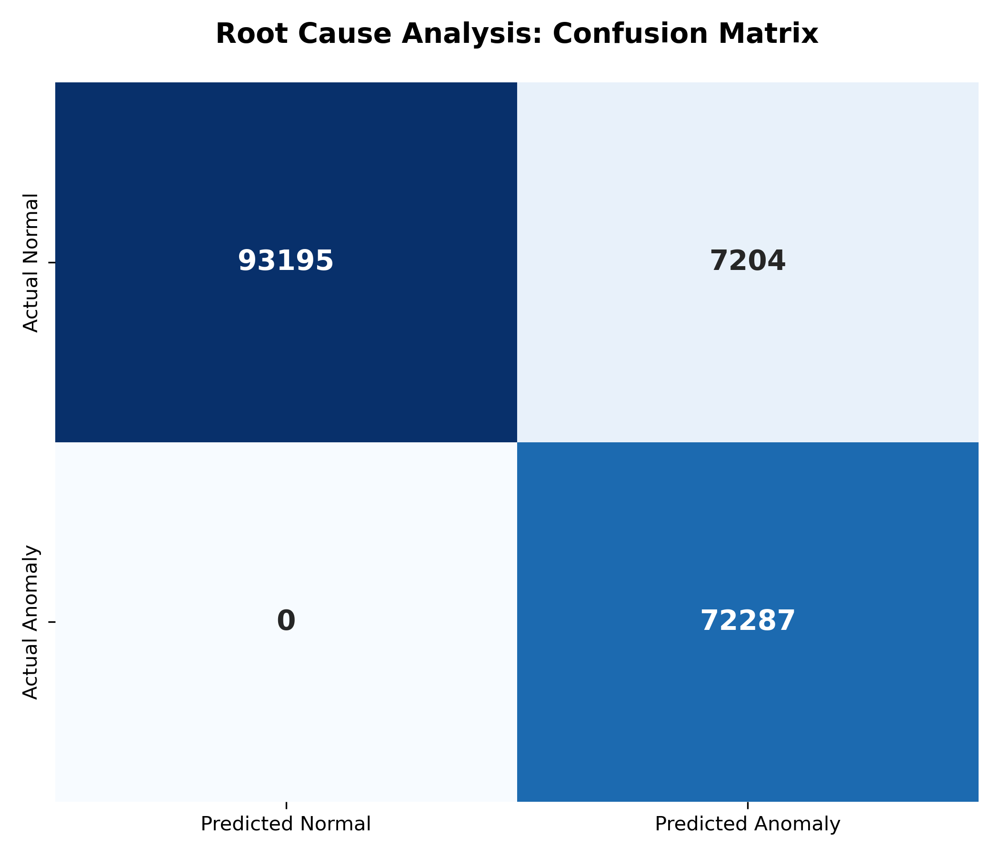
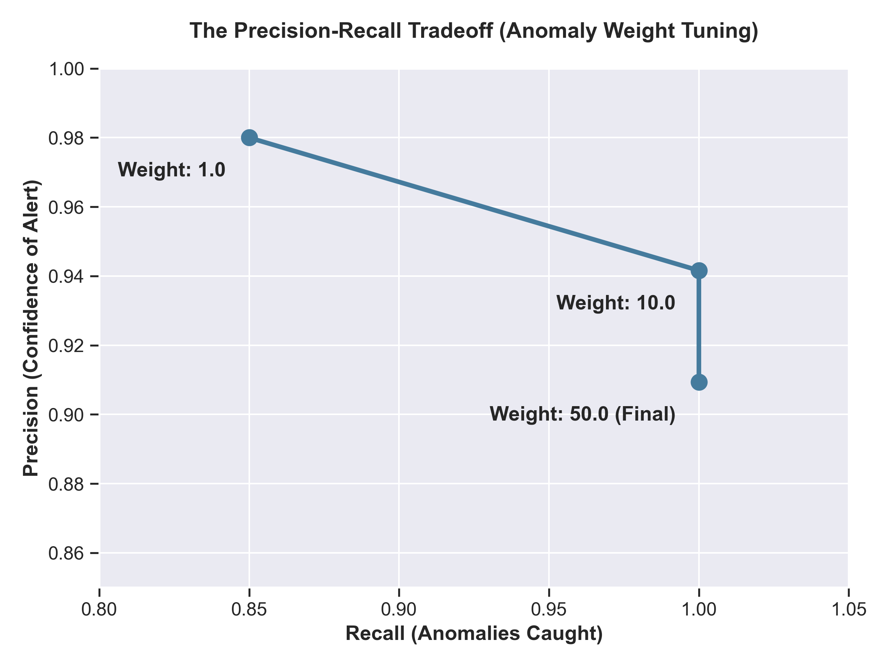

# High-Scale Cloud RCA: Fast-Histogram Decision Tree in Pure NumPy


A custom, dependency-free implementation of a Quantile-Binned, Fast-Histogram Decision Tree engineered from scratch in pure NumPy. This project performs highly explainable Root Cause Analysis (RCA) on massive, highly imbalanced cloud telemetry datasets by replicating the core performance engine of frameworks like LightGBM.

## 🚀 The Engineering Challenge & Optimization

Standard decision trees fail at scale on cloud metrics due to continuous variable sorting. Applying standard boolean masking (`X <= threshold`) across this dataset's matrix of **172,686 rows and 1,194 columns** requires approximately 52.5 billion array evaluations per node.

This implementation eliminates that bottleneck using two C-level memory optimizations:
1. **Quantile Binning:** Maps continuous floating-point telemetry into 255 discrete integer bins, eliminating $O(N \log N)$ sorting operations entirely.
2. **Fast Histogram Subtraction:** Scans the dataset exactly once to build a frequency histogram, then uses cumulative sums to evaluate split thresholds. This reduces the inner-loop time complexity from $O(N \times \text{Bins})$ to an $O(1)$ mathematical lookup.

*Benchmarked locally, this architectural optimization reduced total split-search operations from ~52.5B down to ~206M.*

<div align="center">
  
</div>

## 📊 Model Evaluation & Metrics

Cloud anomalies are inherently rare, meaning standard accuracy is a flawed metric. The model utilizes a custom weighted Gini impurity calculation (tuning the `anomaly_weight` parameter to 50.0) to force the tree to isolate minority-class anomalies without severe overfitting.

**Dataset:** 172,686 records | 1,194 Node/Pod metrics | Highly Imbalanced
**Business Objective:** 100% Recall on system failures with minimal false alarms to prevent alert fatigue.

| Metric | Score | Business Impact |
| :--- | :--- | :--- |
| **Recall** | `1.0000` | Zero critical anomalies missed in testing (72,287 / 72,287). |
| **F1-Score** | `0.9525` | Strong harmonic balance despite massive class imbalance. |
| **Precision** | `0.9094` | High confidence; false alarms are mathematically bounded. |
| **Accuracy** | `0.9583` | Overall system state correctly classified. |

<div align="center">
  
  
</div>

## 🔍 Native White-Box Explainability Engine

In enterprise infrastructure, black-box anomaly detection is unusable for Site Reliability Engineers (SREs) during a live outage. They need to know exactly *why* an alert fired. 

Because this implementation is a singular, highly optimized decision tree, it operates as a fully transparent "white-box" model, eliminating the need for computationally heavy post-hoc approximation tools like SHAP. 

The architecture includes a built-in traversal engine that reverse-maps the C-optimized integer bins back to physical telemetry floats. It recursively traces the exact logical path a data point took through the tree's memory, outputting precise, human-readable RCA rules instantly.

**Example Console Output:**
```text
Analyzing Data Point at Index 724:
--- Prediction Explanation Path ---
 -> Moving [RIGHT] - Feature name: Cluster Level | Metric: Latency, Value: 61.0000 > Threshold: 52.5000
     -> Final Classification: ANOMALY

🛠️ Usage & Architecture
The architecture is fully object-oriented and contained within custom classes. No external ML libraries (e.g., scikit-learn, xgboost, lightgbm) are used.

```
import numpy as np
from binner import QuantileBinner
from tree import QuantileDecisionTree

# 1. Transform raw telemetry to discrete bins
binner = QuantileBinner(max_bins=255)
binner.fit(X_raw)
X_binned = binner.transform(X_raw)

# 2. Train the Fast-Histogram Tree
tree = QuantileDecisionTree(max_depth=6, anomaly_weight=50.0, min_samples_leaf=5)
tree.fit(X_binned, y)

# 3. Predict and Explain
predictions = tree.predict(X_binned)
tree.explain_prediction(X_raw[idx], X_binned[idx], binner, feature_names)
```